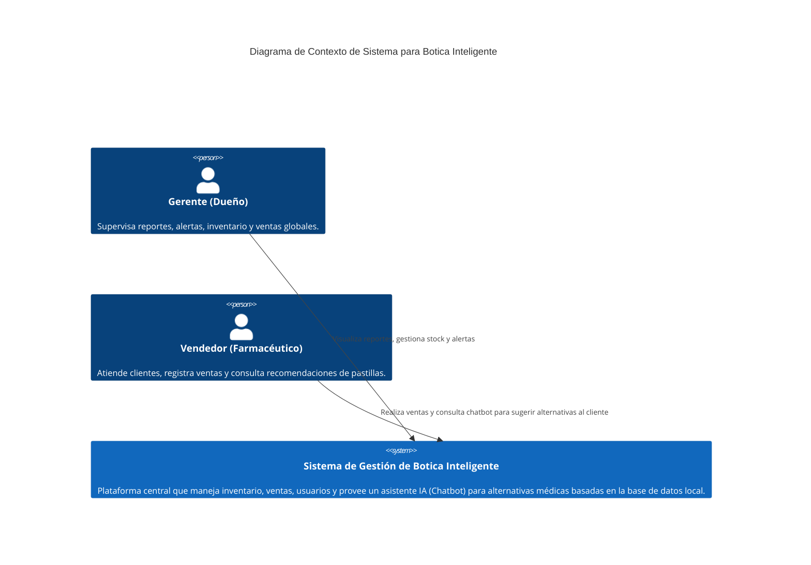
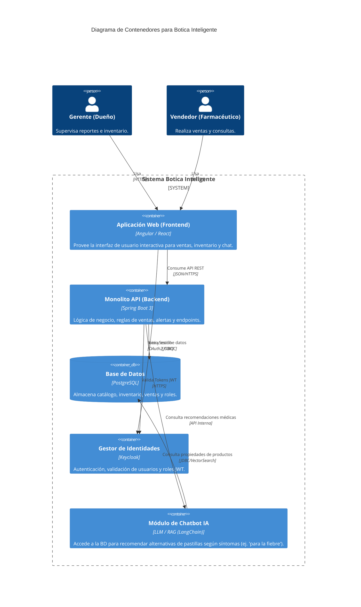

# Arquitectura C4 - Botica Inteligente

## 1. Diagrama de Contexto (Nivel 1)

Muestra el sistema en su conjunto y cómo los usuarios interactúan con él.

## 2. Diagrama de Contenedores (Nivel 2)

Desglosa el sistema en sus principales contenedores (Frontend, Backend, Base de Datos, IA).

